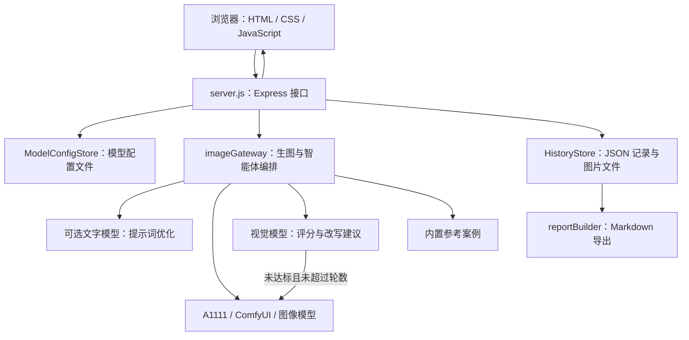

# 木生 AI · 功能与架构说明

依据 2026-09-07 当前工作区源码整理。面向接手开发、产品和模型维护人员；运行与交接流程见 [团队接管手册](TEAM_HANDOVER.md)。

## 功能清单

“已实现”表示代码中已有实现，不代表所有外部模型服务已在本次交接中联调通过。

| 功能 | 当前能力与边界 | 主要代码入口 |
| --- | --- | --- |
| 需求输入与风格设置 | 中文描述、英文 Prompt，明式 / 新中式 / 宋韵 / 禅意，精细度、氛围、画布设置 | `index.html`、`script.js` |
| 提示词处理 | 中文关键词翻译、领域增强、结构化英文尽量保留；可选文字模型优化，失败回退 | `script.js`、`src/providers/textModel.js` |
| 普通生成 | A1111、ComfyUI、兼容 OpenAI 图像接口；支持本地引擎与图像模型并行，保留部分成功结果 | `src/imageGateway.js`、`src/providers/` |
| 智能体生成 | 生图 → 视觉评分 → 修正 Prompt → 再生成；返回各轮、最佳轮与评分；默认目标 85 分、2 轮，后端限制最多 3 轮 | `src/imageGateway.js`、`src/providers/visionModel.js` |
| 模型设置 | 保存引擎地址、LoRA、checkpoint、workflow、文字 / 图像 / 视觉模型配置 | `src/modelConfigStore.js`、`server.js` |
| 结果迭代 | 预览、下载、同参数重跑、变化词重跑、上一版描述回填 | `script.js` |
| 历史管理 | 服务端存储、读取、恢复和删除普通 / 智能体记录及图片，支持重启后读取 | `src/historyStore.js`、`script.js` |
| 教学案例 | 内置案例展示与匹配，作为评审和作品说明的参考；不是外部实时知识库 | `src/referenceKnowledge.js` |
| 作品说明与演示文案 | 根据历史导出 Markdown，包含生成过程、参考案例和 AI 标识等信息；不生成 PPT 文件 | `src/reportBuilder.js`、`script.js` |
| 发布 | Node 直接运行、Docker 本地构建、GitHub Actions 测试与 GHCR 发布、可选 Watchtower | Docker 文件、`.github/workflows/docker-image.yml` |

界面当前默认进入智能体模式。画布默认 `16:9-720p`（1280×720），另有 16:9 1080p、4:3 720p / 1080p；后端兼容旧方形尺寸。图像模型有独立请求尺寸配置，不能假设所有引擎最终输出尺寸完全一致。

“继续细化”主要复用描述与参数再次生成；不应当作已经实现局部重绘、参考图编辑或家具 CAD 建模。视觉模型评分属于模型建议，不能替代真实家具的结构、工艺或承重验证。

## 架构与数据流



普通生成：前端组成提示词和参数 → `/api/generate` → 网关归一化并调用 Provider → 保存历史 → 返回结果。

智能体生成：前端提交需求、目标分数和轮数 → `/api/agent/run` → 网关进行多轮生图与视觉评审 → 达标或到达轮数上限停止 → 返回最佳结果并持久化。当前长任务通过一次 HTTP 请求等待结果，没有独立任务队列或任务状态轮询接口。

## 代码结构和修改入口

```text
项目根目录/
├── index.html / styles.css / script.js   页面、样式与前端逻辑
├── server.js                            HTTP 路由、初始化与持久化调用
├── src/
│   ├── imageGateway.js                  多引擎调度、文字增强、智能体闭环
│   ├── modelConfigStore.js              配置读取、规范化与保存
│   ├── historyStore.js                  历史索引与图片文件
│   ├── referenceKnowledge.js            案例数据与匹配
│   ├── reportBuilder.js                 作品说明与演示文案
│   ├── lib/requestNormalizer.js         尺寸、风格、质量等参数归一化
│   └── providers/                       外部模型适配
├── assets/                              页面公共图片
├── test/                                Node 内置测试
├── docs/                                使用、发布与团队文档
├── .github/workflows/docker-image.yml    自动测试、构建与发布
└── Dockerfile / docker-compose*.yml      容器运行配置
```

新增风格时需一起检查前端选择项、提示词与后端风格映射；调整尺寸需同步前端选项、`requestNormalizer` 和测试；新增模型厂商优先扩展 Provider，再接入网关和配置面板；改评审规则查看视觉 Provider 与智能体循环；改报告查看 `reportBuilder` 及前端导出回退逻辑。详细文件说明见 [FILE_MAP.md](FILE_MAP.md)。

## 接口清单

| 方法与路径 | 用途 |
| --- | --- |
| `GET /api/health` | 网关及引擎状态；具体可用性受模型服务影响 |
| `GET /api/engines` | 支持的引擎和默认引擎 |
| `GET /api/config` / `POST /api/config` | 读取脱敏配置 / 修改全实例配置 |
| `POST /api/generate` | 普通或并行生成并保存历史 |
| `POST /api/agent/run` | 多轮生成评审并保存历史 |
| `GET /api/reference-cases` | 内置参考案例 |
| `GET /api/history` | 历史列表，可传 `limit`，默认 100、最多 500 |
| `GET /api/history/:id` | 单条历史 |
| `DELETE /api/history/:id` | 删除记录及已保存图片 |
| `GET /api/history/assets/:filename` | 读取持久化图片 |
| `GET /api/history/:id/report` | 作品说明；加 `?format=demo` 返回演示文案 |

报告接口返回包含 `content`、`filename` 和 `mimeType` 的 JSON，前端将其下载为 Markdown。以上接口目前没有用户身份和角色隔离，不能以“接口存在”推断其已适合公开部署。

## 接下来按什么顺序建设

1. 先完成团队接管、真实模型验收、配置及数据恢复演练。
2. 集中部署前修复静态文件暴露和访问权限问题，详见接管手册。
3. 多人实际使用后补任务队列、并发与费用控制、成员数据隔离。
4. 根据真实需求再做 LoRA 枚举、专用 ComfyUI workflow、前端拆分与更多模型适配。

账号体系、成员权限、协作编辑、任务队列、数据库存储、LoRA 自动枚举和 CAD / 三维结构输出均不在当前已实现清单内。
